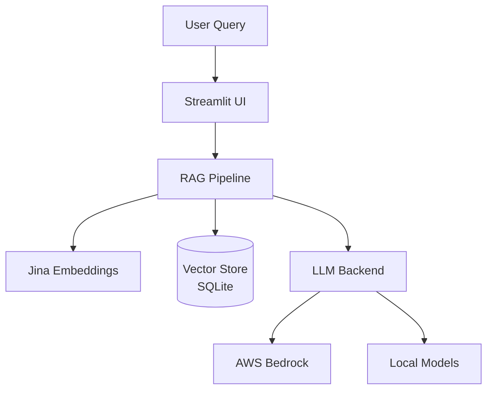

# WattBot RAG User Interface

A Streamlit-based chat interface for the KohakuRAG pipeline, enabling interactive Q&A over the WattBot research corpus on sustainable AI.

## Project Context

This repository supports the Research Cyberinfrastructure Exploration initiative at UW-Madison. The goal is to build a long-running chatbot that answers questions about the environmental impacts of AI using a curated corpus of energy and sustainability research papers.

The project uses [KohakuRAG](https://github.com/KohakuBlueleaf/KohakuRAG), the top-ranked solution from the 2025 WattBot Challenge, as the core retrieval engine. This repository focuses on:

1. Building a user-facing Streamlit interface
2. Deploying the system on AWS using Bedrock for LLM inference
3. Comparing managed cloud deployment against self-hosted alternatives

## Architecture

The system follows a standard RAG (Retrieval-Augmented Generation) architecture:



### Deployment Options

| Approach | LLM Backend | Use Case |
|----------|-------------|----------|
| AWS Bedrock | Managed foundation models via API | Production, on-demand usage |
| Local | Small models under 1B params | Development, on-prem deployment |

## Documentation

- [Bedrock Integration Proposal](docs/bedrock-integration-proposal.md) - AWS Bedrock design and implementation plan
- [Meeting Notes](docs/meeting-notes.md) - Team discussions and decisions

## Repository Structure

```
.
├── docs/
│   ├── bedrock-integration-proposal.md   # AWS Bedrock design document
│   └── meeting-notes.md                  # Team meeting notes
├── src/                                  # Application source code
├── configs/                              # Pipeline configuration
├── .env.example                          # Environment template
└── README.md
```

## Setup & Installation

### 1. Prerequisites

- Python 3.10+
- AWS Account with Bedrock access (Claude 3 models enabled)
- [AWS CLI v2](https://docs.aws.amazon.com/cli/latest/userguide/install-cliv2.html) installed and configured
- NVIDIA GPU with CUDA (recommended for indexing)

### 2. AWS Configuration

Configure AWS SSO credentials for the Bedrock profile:

```bash
aws configure sso
# Profile name: bedrock_nils
# Start URL: https://d-xxxxxxxxxx.awsapps.com/start
# Region: us-east-2
```

Login before running any Bedrock scripts:

```bash
aws sso login --profile bedrock_nils
```

### 3. Installation

Clone the repository with submodules:

```bash
git clone --recurse-submodules https://github.com/matteso1/KohakuRAG_UI.git
cd KohakuRAG_UI
```

Install dependencies:

```bash
pip install -r requirements.txt
pip install -e KohakuRAG/
```

### 4. Data Setup (WattBot 2025)

1. Place `WattBot2025.zip` in the project root
2. Extract the dataset:

   ```powershell
   Expand-Archive -Path "WattBot2025.zip" -DestinationPath "data/" -Force
   ```

3. Fetch documents and build index:

   ```bash
   # Fetch PDFs (this will download ~3000 PDFs)
   python KohakuRAG/scripts/wattbot_fetch_docs.py --metadata data/metadata.csv 

   # Build vector index (requires GPU)
   python KohakuRAG/scripts/wattbot_build_index.py --docs-dir artifacts/docs --db artifacts/wattbot.db --metadata data/metadata.csv
   ```

## Usage

### Run End-to-End RAG Demo

Test the full pipeline with a custom question:

```bash
python scripts/demo_bedrock_rag.py --question "What is the carbon footprint of training large language models?"
```

Expected output:

- Retrieves relevant snippets from `artifacts/wattbot.db`
- Generates structured answer using Claude 3 via Bedrock
- Displays explanation and sources

### Unit Tests

Run the test suite to verify connectivity and logic:

```bash
python scripts/test_bedrock_model.py
```

## Development Branches

- **main**: Stable releases and documentation
- **bedrock**: AWS Bedrock integration (Nils)
- **local**: Local/on-prem LLM support (Blaise)

## Related Resources

- [KohakuRAG](https://github.com/KohakuBlueleaf/KohakuRAG) - Core RAG engine
- [WattBot 2025 Competition](https://www.kaggle.com/competitions/WattBot2025/overview) - Original challenge
- [AWS Bedrock Documentation](https://docs.aws.amazon.com/bedrock/) - Managed LLM service
- [Generative AI with Amazon Bedrock](https://www.coursera.org/learn/generative-ai-applications-amazon-bedrock) - Coursera course

## Team

| Name | Role | GitHub |
|------|------|--------|
| Chris Endemann | Research Supervisor | [@qualiaMachine](https://github.com/qualiaMachine) |
| Blaise Enuh | Local deployment | [@EnuhBlaise](https://github.com/EnuhBlaise) |
| Nils Matteson | AWS Bedrock integration | [@matteso1](https://github.com/matteso1) |

## License

Research project under UW-Madison Research Cyberinfrastructure.
