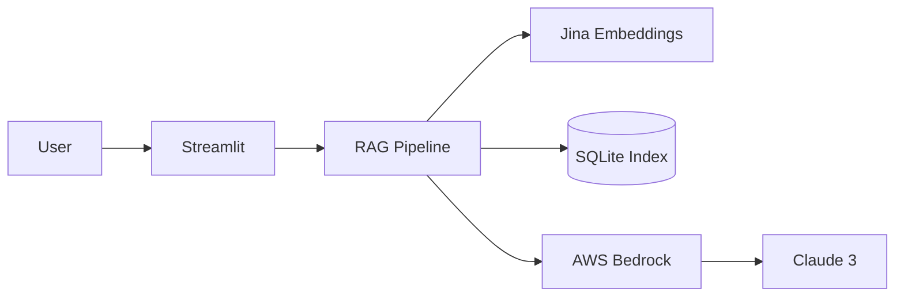

# WattBot RAG User Interface

Streamlit interface for the KohakuRAG pipeline. Answers questions about AI sustainability research using AWS Bedrock.

## Project Overview

This repo wraps [KohakuRAG](https://github.com/KohakuBlueleaf/KohakuRAG) (the #1 solution from WattBot 2025) with a web interface and deploys it on AWS. The goal is a pay-per-use chatbot that answers questions about the environmental impacts of AI, with proper citations.

**Current Status:**
- Bedrock integration: complete
- Streamlit UI: in progress (Blaise)
- Deployment: planned

## Architecture



The vector index is a single SQLite file (~80MB) containing embedded research papers. Queries hit Bedrock for answer generation. No always-on infrastructure.

## Setup

### Prerequisites

- Python 3.10+
- AWS CLI v2 with SSO configured
- NVIDIA GPU (for embedding, optional if using pre-built index)

### Installation

```bash
git clone --recurse-submodules https://github.com/matteso1/KohakuRAG_UI.git
cd KohakuRAG_UI

pip install -r requirements.txt
pip install -e KohakuRAG/

# AWS auth
aws sso login --profile bedrock_nils
```

### Get the Vector Index

Pre-built index is on S3:

```bash
aws s3 cp s3://wattbot-nils-kohakurag/indexes/wattbot_jinav4.db artifacts/wattbot_jinav4.db --profile bedrock_nils
```

### Run Demo

```bash
python scripts/demo_bedrock_rag.py --question "What is the carbon footprint of training GPT-3?"
```

## Benchmark Scores

| Config | Score | Notes |
|--------|-------|-------|
| JinaV3 + Haiku | 0.665 | Current baseline |
| JinaV4 + Sonnet | 0.633 | Better model, context issues |
| Winning solution | 0.861 | GPT-OSS-120B + 9x ensemble |

Gap is mostly model size and ensemble voting. Could get closer with Sonnet + ensemble but costs 50x more per query.

## Cost

- Haiku: ~$0.003/query
- Sonnet: ~$0.03/query
- Idle: $0 (Bedrock is pay-per-use)

## Repo Structure

```
KohakuRAG_UI/
├── src/llm_bedrock.py         # Bedrock integration
├── scripts/
│   ├── demo_bedrock_rag.py    # E2E demo
│   └── run_wattbot_eval.py    # Batch evaluation
├── configs/                    # Index configs
├── docs/                       # Documentation
├── KohakuRAG/                  # Submodule
└── artifacts/                  # Vector indexes (gitignored)
```

## Branches

| Branch | Owner | Status |
|--------|-------|--------|
| main | Team | Stable |
| bedrock | Nils | Complete |
| local | Blaise | In progress |

## For Blaise

Download the index:
```bash
aws s3 cp s3://wattbot-nils-kohakurag/indexes/wattbot_jinav4.db artifacts/
```

Basic usage:
```python
from llm_bedrock import BedrockChatModel

chat = BedrockChatModel(
    profile_name="bedrock_nils",
    region_name="us-east-2",
    model_id="us.anthropic.claude-3-haiku-20240307-v1:0"
)

answer = await chat.complete(prompt)
```

See `scripts/demo_bedrock_rag.py` for full pipeline example.

## Docs

- [Progress Report](docs/tuesday-progress-report.md) - Week 1 accomplishments
- [Bedrock Proposal](docs/bedrock-integration-proposal.md) - Technical design

## Team

- Chris Endemann - Supervisor
- Nils Matteson - Bedrock integration
- Blaise Enuh - Streamlit UI
