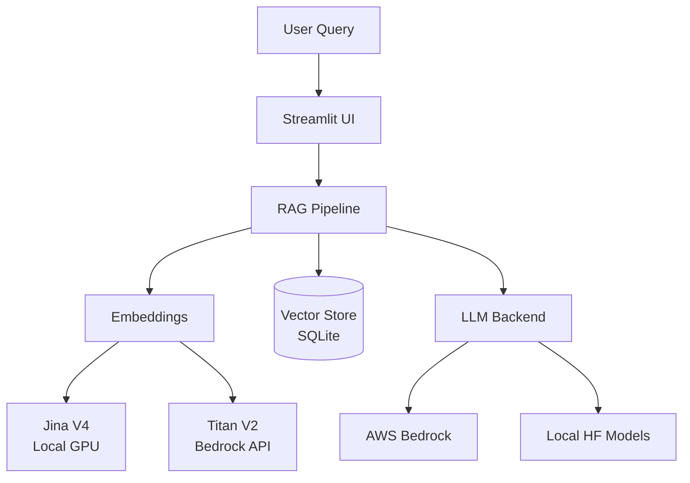

# WattBot RAG User Interface

A Streamlit-based chat interface for the KohakuRAG pipeline, enabling interactive Q&A over the WattBot research corpus on sustainable AI.

## Project Context

This repository supports the Research Cyberinfrastructure Exploration initiative at UW-Madison. The goal is to build a long-running chatbot that answers questions about the environmental impacts of AI using a curated corpus of energy and sustainability research papers.

The project uses [KohakuRAG](https://github.com/KohakuBlueleaf/KohakuRAG), the top-ranked solution from the 2025 WattBot Challenge, as the core retrieval engine. This repository focuses on:

1. Building a user-facing Streamlit interface
2. Deploying the system on AWS using Bedrock for LLM inference
3. Comparing managed cloud deployment against self-hosted alternatives

## Quick Start

### Bedrock mode (no GPU required)

```bash
pip install -r bedrock_requirements.txt
pip install -e vendor/KohakuVault -e vendor/KohakuRAG
streamlit run app.py -- --mode bedrock
```

### Local mode (requires CUDA GPU)

```bash
pip install -r local_requirements.txt
pip install -e vendor/KohakuVault -e vendor/KohakuRAG
streamlit run app.py -- --mode local
```

When both backends are installed and a GPU is detected, the sidebar shows a
toggle to switch between local and Bedrock models at runtime.

See [Setup Bedrock](docs/Setup_Bedrock.md) for full AWS configuration instructions.

## Architecture

The system follows a standard RAG (Retrieval-Augmented Generation) architecture:



### Deployment Options

| Approach | LLM Backend | Embeddings | Launch command |
|----------|-------------|------------|----------------|
| AWS Bedrock | Managed foundation models via API | Titan V2 (API) | `streamlit run app.py -- --mode bedrock` |
| Local GPU | HuggingFace models (Qwen, Llama, etc.) | Jina V4 (local) | `streamlit run app.py -- --mode local` |

If `--mode` is omitted, the app defaults to **bedrock**.

## Documentation

- [Bedrock Setup Guide](docs/Setup_Bedrock.md) - Full AWS Bedrock setup and usage instructions
- [Bedrock Integration Proposal](docs/bedrock-integration-proposal.md) - AWS Bedrock design and implementation plan
- [Meeting Notes](docs/meeting-notes.md) - Team discussions and decisions

## Repository Structure

```
.
├── app.py                                # Streamlit app (supports --mode bedrock|local)
├── bedrock_requirements.txt              # Torch-free Bedrock dependencies
├── local_requirements.txt                # GPU/local model dependencies
├── scripts/
│   ├── llm_bedrock.py                    # BedrockChatModel & BedrockEmbeddingModel
│   ├── run_experiment.py                 # Batch experiment runner
│   └── demo_bedrock_rag.py              # Bedrock RAG demo
├── vendor/KohakuRAG/configs/             # Pipeline & experiment configs
│   ├── hf_*.py                           # Local HuggingFace model configs
│   └── bedrock_*.py                      # AWS Bedrock model configs
├── data/embeddings/                      # Vector databases
├── docs/                                 # Documentation
├── .env.example                          # Environment template
└── README.md
```

## Development Branches

- **main**: Stable releases and documentation
- **bedrock**: AWS Bedrock integration (Nils)
- **local**: Local/on-prem LLM support (Blaise)

## Related Resources

- [KohakuRAG](https://github.com/KohakuBlueleaf/KohakuRAG) - Core RAG engine
- [WattBot 2025 Competition](https://www.kaggle.com/competitions/WattBot2025/overview) - Original challenge
- [AWS Bedrock Documentation](https://docs.aws.amazon.com/bedrock/) - Managed LLM service
- [Generative AI with Amazon Bedrock](https://www.coursera.org/learn/generative-ai-applications-amazon-bedrock) - Coursera course

## Team

| Name | Role | GitHub |
|------|------|--------|
| Chris Endemann | Research Supervisor | [@qualiaMachine](https://github.com/qualiaMachine) |
| Blaise Enuh | Local deployment | [@EnuhBlaise](https://github.com/EnuhBlaise) |
| Nils Matteson | AWS Bedrock integration | [@matteso1](https://github.com/matteso1) |

## License

Research project under UW-Madison Research Cyberinfrastructure.
