# WattBot RAG User Interface

A production-ready chatbot interface for answering questions about AI sustainability research using the award-winning KohakuRAG pipeline and AWS Bedrock.

## Overview

This project builds a long-running RAG (Retrieval-Augmented Generation) application using the WattBot corpus—a curated set of ~200 energy and sustainability research papers. It provides accurate answers with transparent citations about the environmental impacts of AI.

**Key Features:**
- 🏆 Uses [KohakuRAG](https://github.com/KohakuBlueleaf/KohakuRAG) (#1 solution from 2025 WattBot Challenge)
- ☁️ Deployed on AWS Bedrock for on-demand, serverless LLM access
- 💰 Cost-efficient: pay-per-use model, no always-on infrastructure
- 🔒 Gated access with UW NetID authentication
- 📊 Comprehensive evaluation against competition benchmarks

---

## Architecture

### System Overview

```mermaid
graph TB
    User[👤 User] -->|Query| UI[🖥️ Streamlit UI]
    UI -->|Question| RAG[RAG Pipeline]

    subgraph "RAG Pipeline - KohakuRAG"
        RAG -->|1. Embed Query| Emb[🧠 Jina Embeddings<br/>JinaV4 512-dim]
        RAG -->|2. Search| VDB[(📚 Vector Store<br/>SQLite + sqlite-vec<br/>82MB)]
        RAG -->|3. Retrieve Context| Ret[📄 Top-k Retrieval<br/>Hierarchical Search]
        Ret -->|4. Generate Answer| LLM[🤖 LLM Backend]
    end

    LLM -->|AWS Bedrock API| Bedrock[☁️ AWS Bedrock<br/>Claude 3.5 Sonnet]
    Bedrock -->|Answer + Citations| UI

    S3[(☁️ S3 Bucket<br/>wattbot-nils-kohakurag)] -.->|Download Index| VDB

    style RAG fill:#e1f5ff
    style Bedrock fill:#ff9900
    style UI fill:#90EE90
```



### Request Flow


### Deployment Architecture

```mermaid
graph LR
    subgraph "AWS Cloud"
        EC2[EC2 Instance<br/>Streamlit App]
        S3[S3 Bucket<br/>Vector Index]
        Bedrock[AWS Bedrock<br/>Claude Models]
        IAM[IAM Role<br/>Bedrock + S3]

        EC2 -->|Read Index| S3
        EC2 -->|LLM Calls| Bedrock
        IAM -.->|Permissions| EC2
    end

    subgraph "Authentication"
        Proxy[Auth Proxy<br/>UW NetID SSO]
        Allow[Email Allowlist]
    end

    User[👤 Users] -->|Login| Proxy
    Proxy -->|Check| Allow
    Allow -->|Allowed| EC2

    style EC2 fill:#90EE90
    style Bedrock fill:#ff9900
    style Proxy fill:#FFD700
```



---

## Project Status

### ✅ Completed (Bedrock Branch)

**1. AWS Bedrock Integration**
- Production-ready `BedrockChatModel` class
- AWS SSO authentication (no hardcoded secrets)
- Exponential backoff with jitter for rate limiting
- Async/await architecture with semaphore-based concurrency control

**2. Vector Index Setup**
- JinaV4 multimodal embeddings (512-dim)
- SQLite + KohakuVault storage (82MB)
- Hosted on S3: `s3://wattbot-nils-kohakurag/indexes/wattbot_jinav4.db`
- Ready for team download

**3. End-to-End Pipeline**
- Question → Retrieval → Bedrock → Structured Answer
- Working demo script with citations
- Competition score: **0.665** (JinaV3 + Haiku)

### 🚧 In Progress

**1. Streamlit UI** (Blaise)
- Chat interface design
- Session management
- Result rendering with citations

**2. Deployment** (Team)
- EC2 instance setup
- Auth proxy configuration
- Cost monitoring

### 📋 Planned

- Score optimization with Claude 3.5 Sonnet
- Ensemble voting (5x parallel runs)
- On-prem comparison (GB10 hardware)

---

## Quick Start

### Prerequisites

- Python 3.10+
- AWS Account with Bedrock access (Claude models enabled)
- AWS CLI v2 with SSO configured
- NVIDIA GPU with CUDA (for local indexing)

### Installation

```bash
# Clone with submodules
git clone --recurse-submodules https://github.com/matteso1/KohakuRAG_UI.git
cd KohakuRAG_UI

# Install dependencies
pip install -r requirements.txt
pip install -e KohakuRAG/

# Configure AWS SSO
aws configure sso
# Profile: bedrock_nils
# Region: us-east-2

# Login to AWS
aws sso login --profile bedrock_nils
```

### Download Vector Index from S3

```bash
# Download the pre-built JinaV4 index
aws s3 cp s3://wattbot-nils-kohakurag/indexes/wattbot_jinav4.db artifacts/wattbot_jinav4.db --profile bedrock_nils

# Or use JinaV3 index (30MB)
aws s3 cp s3://wattbot-nils-kohakurag/indexes/wattbot.db artifacts/wattbot.db --profile bedrock_nils
```

### Run the Demo

```bash
# Simple demo with one question
python scripts/demo_bedrock_rag.py --question "What is the carbon footprint of training GPT-3?"
```

**Expected Output:**
```
Answer: The carbon footprint of training GPT-3 is over 550 metric tons of CO2 equivalent.
Sources: ['jegham2025']
```

---

## Benchmark Results

### Competition Scores

| Configuration | Score | Model | Context | Notes |
|--------------|-------|-------|---------|-------|
| **Baseline** | 0.665 | Claude 3 Haiku | top_k=5 | Current working |
| JinaV4 + Haiku | 0.559 | Claude 3 Haiku | top_k=8 | Context limits |
| JinaV4 + Sonnet | 0.633 | Claude 3.5 Sonnet | top_k=10 | Better model |
| **Winning Solution** | 0.861 | GPT-OSS-120B | top_k=16 | 9x ensemble |

### Score Components


**Gap Analysis:**

The 0.20 score gap to the winning solution is due to:
1. **Model size** - Haiku (smaller, faster) vs GPT-OSS-120B (larger, smarter)
2. **Ensemble voting** - Single run vs 9x runs with majority voting
3. **Context window** - Bedrock limits vs larger context for OpenRouter

---

## Available Models

| Model | Context | Cost/1M Input | Cost/1M Output | Use Case |
|-------|---------|---------------|----------------|----------|
| Claude 3 Haiku | 200K | ~$0.25 | ~$1.25 | Testing, high-volume |
| Claude 3.5 Sonnet | 200K | ~$3 | ~$15 | Production |
| Claude 3.7 Sonnet | 200K | ~$3 | ~$15 | Latest, best quality |
| Claude Opus 4.5 | 200K | ~$15 | ~$75 | Maximum accuracy |

**All models verified on AWS Account:** `183295408236`

---

## Repository Structure

```
KohakuRAG_UI/
├── src/
│   └── llm_bedrock.py           # AWS Bedrock integration
├── scripts/
│   ├── demo_bedrock_rag.py      # End-to-end demo
│   ├── run_wattbot_eval.py      # Batch evaluation
│   └── test_bedrock_model.py    # Unit tests
├── workflows/
│   └── bedrock_ensemble_runner.py  # 5x ensemble with voting
├── configs/
│   └── jinav4_index.py          # JinaV4 index config
├── docs/
│   ├── tuesday-progress-report.md  # Weekly progress
│   ├── bedrock-integration-proposal.md
│   └── DEMO_GUIDE.md            # Presentation guide
├── KohakuRAG/                   # Submodule (winning solution)
└── README.md
```

---

## For Blaise - UI Integration

### Download the Index

```bash
aws s3 cp s3://wattbot-nils-kohakurag/indexes/wattbot_jinav4.db artifacts/
```

### Initialize the Pipeline

```python
import sys
sys.path.insert(0, "src")
sys.path.insert(0, "KohakuRAG/src")

from llm_bedrock import BedrockChatModel
from kohakurag.datastore import KVaultNodeStore
from kohakurag.embeddings import JinaV4EmbeddingModel

# Initialize once (global state)
chat = BedrockChatModel(
    profile_name="bedrock_nils",
    region_name="us-east-2",
    model_id="us.anthropic.claude-3-haiku-20240307-v1:0",
    max_concurrent=3
)

store = KVaultNodeStore(
    path="artifacts/wattbot_jinav4.db",
    table_prefix="wattbot_jv4",
    dimensions=512
)

embedder = JinaV4EmbeddingModel(
    model_name="jinaai/jina-embeddings-v4",
    dimensions=512,
    task="retrieval"
)
```

### Handle User Queries

```python
async def answer_question(user_input: str) -> dict:
    """Process one user question through the RAG pipeline."""
    # 1. Embed query
    query_vec = await embedder.embed([user_input])

    # 2. Search vector store
    results = await store.search(query_vec[0], top_k=5)

    # 3. Build context from results
    context = "\n\n".join([node.content for node, score in results])

    # 4. Generate answer
    prompt = f"Context:\n{context}\n\nQuestion: {user_input}\n\nAnswer:"
    answer = await chat.complete(prompt)

    return {
        "answer": answer,
        "sources": [node.metadata.get("doc_id") for node, _ in results]
    }
```

---

## Cost Estimation

### Per Query Cost (Claude 3 Haiku)

- Input: ~10K tokens (context) × $0.25/1M = **$0.0025**
- Output: ~500 tokens (answer) × $1.25/1M = **$0.0006**
- **Total: ~$0.003 per question**

### Monthly Estimates

| Usage | Questions/Month | Cost/Month |
|-------|-----------------|------------|
| Light | 1,000 | $3 |
| Medium | 10,000 | $30 |
| Heavy | 100,000 | $300 |

**Idle cost:** $0 (Bedrock is pay-per-use, no always-on charges)

---

## Development Branches

| Branch | Owner | Status | Description |
|--------|-------|--------|-------------|
| `main` | Team | Stable | Documentation and releases |
| `bedrock` | Nils | ✅ Complete | AWS Bedrock integration |
| `local` | Blaise | 🚧 In Progress | Streamlit UI + local models |

---

## Documentation

- **[Tuesday Progress Report](docs/tuesday-progress-report.md)** - Weekly accomplishments
- **[Demo Guide](DEMO_GUIDE.md)** - Presentation talking points
- **[Bedrock Integration Proposal](docs/bedrock-integration-proposal.md)** - Technical design
- **[Meeting Notes](docs/meeting-notes.md)** - Team discussions

---

## Related Resources

- [KohakuRAG](https://github.com/KohakuBlueleaf/KohakuRAG) - Core RAG engine
- [KohakuRAG Paper](https://drive.google.com/file/d/16cuDubYSbolzZyhu8UqXxvg7jLJUycjS/view) - Technical writeup
- [WattBot 2025 Competition](https://www.kaggle.com/competitions/wattbot-2025) - Original challenge
- [AWS Bedrock Docs](https://docs.aws.amazon.com/bedrock/) - Managed LLM service
- [Building GenAI Apps with Streamlit](https://www.coursera.org/learn/fast-prototyping-of-genai-apps-with-streamlit)

---

## Team

| Name | Role | Focus |
|------|------|-------|
| **Chris Endemann** | Research Supervisor | Architecture & guidance |
| **Nils Matteson** | AWS Integration | Bedrock backend, deployment |
| **Blaise Enuh** | UI Development | Streamlit frontend, local models |

**GitHub:** [matteso1/KohakuRAG_UI](https://github.com/matteso1/KohakuRAG_UI)

---

## License

Research project under UW-Madison Research Cyberinfrastructure Exploration initiative.
