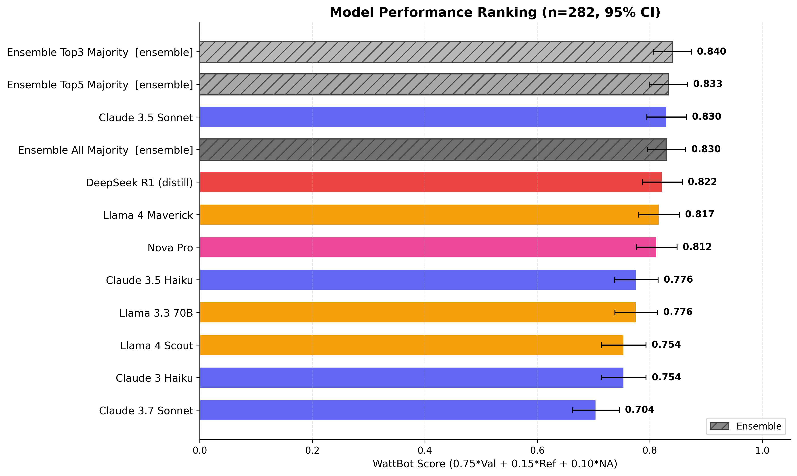
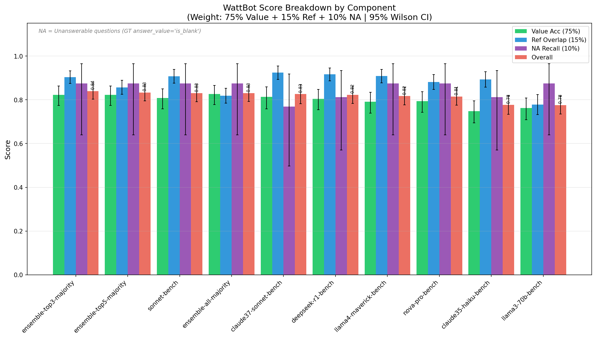
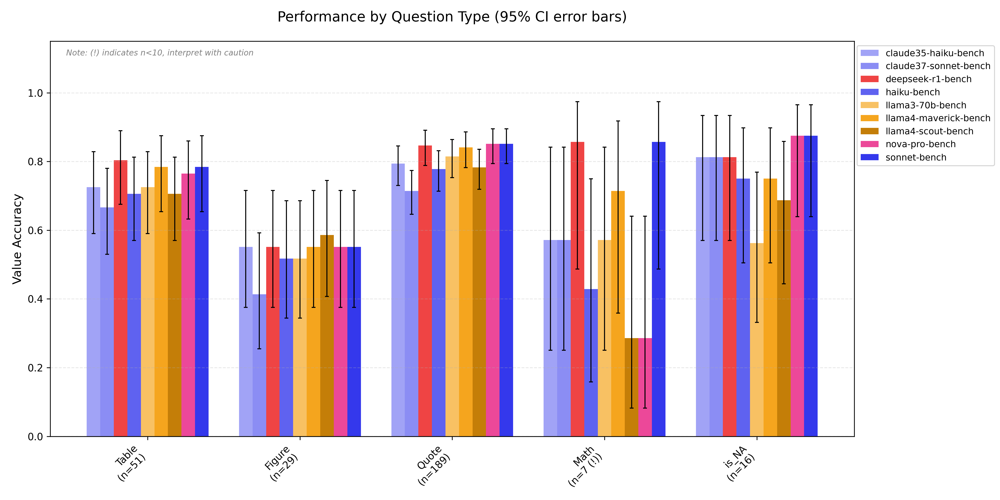
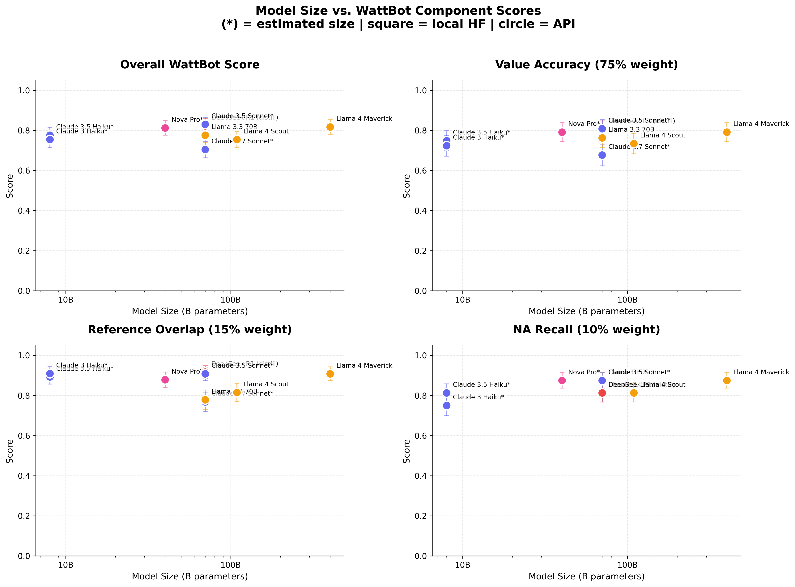
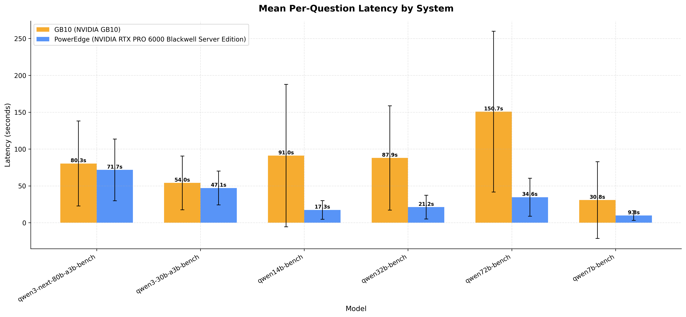
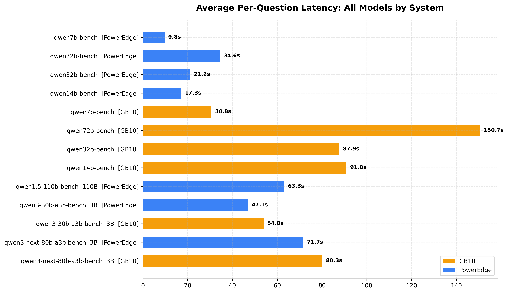
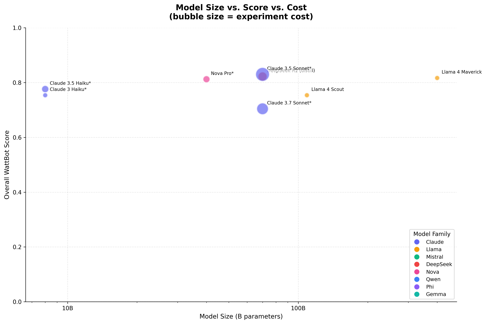
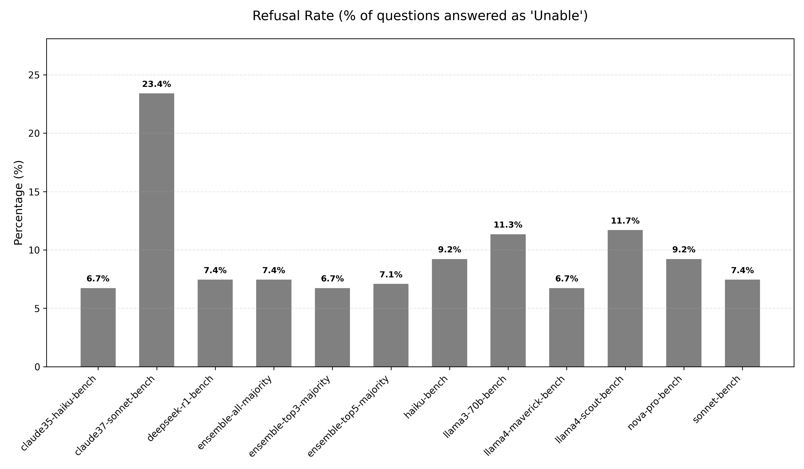
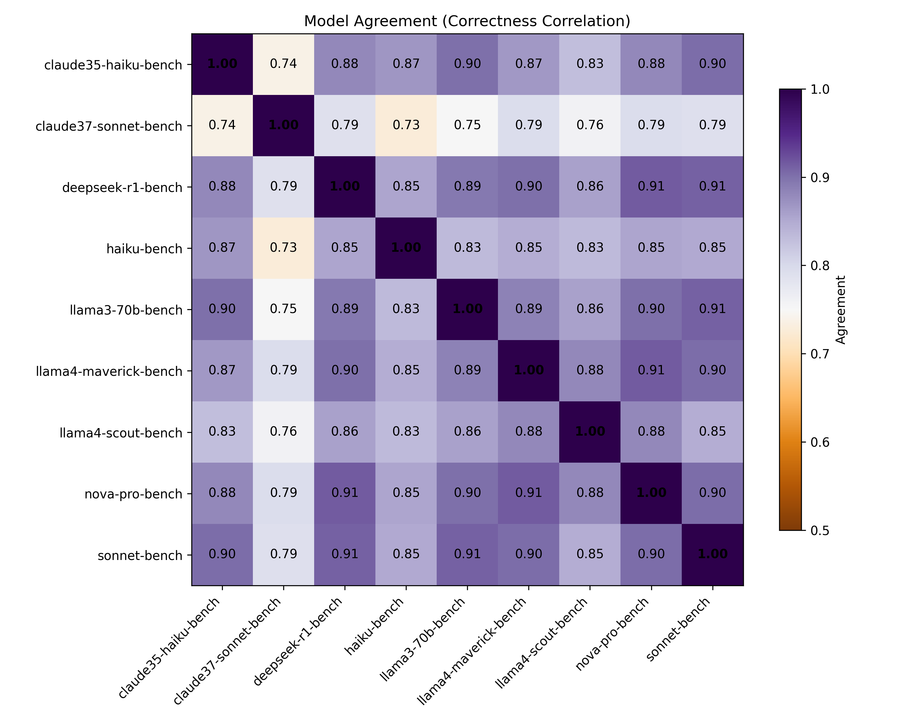
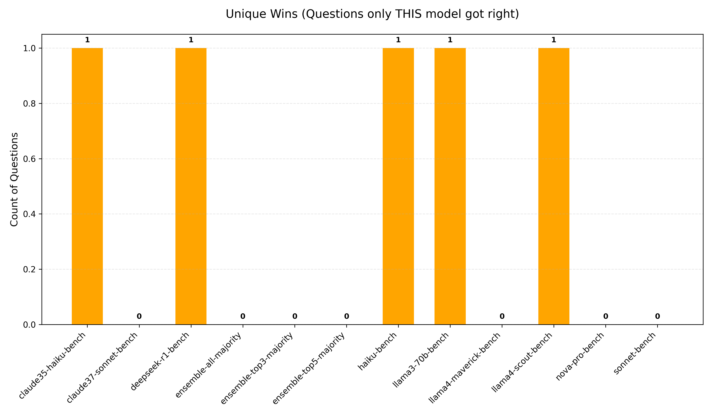

# WattBot RAG Benchmark Report

## Cross-Environment Evaluation of KohakuRAG across Bedrock, PowerEdge, and GB10

---

## 1. Introduction

This report presents the results of a comprehensive benchmark of the KohakuRAG retrieval-augmented generation (RAG) pipeline across three deployment environments: **AWS Bedrock** (cloud API), **Dell PowerEdge** (dual-GPU server), and **Dell Pro Max GB10** (single-GPU workstation). The evaluation covers 282 questions from the WattBot 2025 Challenge test set — a domain-specific Q&A task over a curated corpus of sustainability and AI-energy research papers.

The benchmark addresses three practical questions:

1. **Which LLMs perform best** on factual, citation-grounded Q&A within a fixed RAG pipeline?
2. **How do deployment environments compare** on accuracy, latency, energy, and cost?
3. **Does ensemble voting improve** over the best individual model?

### Team

| Name | Role | GitHub |
|------|------|--------|
| Chris Endemann | Research Supervisor | @qualiaMachine |
| Blaise Enuh | Local deployment | @EnuhBlaise |
| Nils Matteson | AWS Bedrock integration | @matteso1 |

---

## 2. Experimental Setup

### 2.1 Corpus and Test Dataset

The WattBot corpus comprises **745 parsed JSON documents** drawn from sustainability, energy-efficiency, and AI-infrastructure research literature. Each document was sourced from PDFs, parsed into structured text, and indexed into a hierarchical vector store.

The **test set** contains **282 questions** (from the WattBot 2025 Challenge `test_solutions.csv`), each annotated with:

- **answer_value**: The correct numeric or categorical answer
- **answer_unit**: The unit of measurement
- **ref_id**: Ground-truth reference document(s)
- **Binary question-type flags**: `Quote`, `Table`, `Figure`, `Math`, `is_NA`

**Question type distribution** (questions may have multiple flags):

| Type | Description | Count |
|------|-------------|-------|
| Quote | Answer extracted directly from text | 181 |
| Table | Answer found in a table | 331 |
| Figure | Answer found in a figure/chart | 221 |
| Math | Answer requires calculation | 71 |
| is_NA | Answer is unanswerable ("is_blank") | 16 |

### 2.2 The Three Deployment Environments

Each environment runs the **same KohakuRAG pipeline** with environment-specific backends for the LLM and embedding stages. The pipeline logic — query planning, hierarchical retrieval, reranking, iterative deepening, and answer extraction — is identical across environments.

#### Bedrock (Cloud API)

| Property | Value |
|----------|-------|
| **Provider** | AWS Bedrock |
| **Hardware** | Windows workstation (no GPU required) |
| **Embedding model** | Amazon Titan Text Embeddings V2 (1024-dim) |
| **Vector store** | SQLite + sqlite-vec (`wattbot_titan_v2.db`) |
| **LLM access** | Bedrock API (pay-per-token) |
| **Models tested** | 9: Claude 3.5 Sonnet, Claude 3.5 Haiku, Claude 3 Haiku, DeepSeek R1 (distill), Llama 3.3 70B, Llama 4 Maverick, Llama 4 Scout, Nova Pro, Claude 3.7 Sonnet |
| **Key config** | `top_k=8`, `max_retries=3`, `rerank_strategy=combined`, `top_k_final=10`, `retrieval_threshold=0.25` |

#### PowerEdge (Dual-GPU Server)

| Property | Value |
|----------|-------|
| **Provider** | HuggingFace Local (hf_local) |
| **Hardware** | AMD EPYC 9555 64-core, 2× NVIDIA RTX PRO 6000 Blackwell (95 GB VRAM total) |
| **Embedding model** | Jina Embeddings V4 (1024-dim, Matryoshka) |
| **Vector store** | SQLite + sqlite-vec (`wattbot_jinav4.db`) |
| **LLM access** | Local inference, 4-bit quantization |
| **Models tested** | 7 individual + 3 ensembles: Qwen 2.5 (7B, 14B, 32B, 72B), Qwen 1.5 110B, Qwen3 30B-A3B, Qwen3-Next 80B-A3B |
| **Key config** | `top_k=8`, `max_retries=2`, `embedding_model=jinav4`, `temperature=0.2`, `max_new_tokens=512` |

#### GB10 (Single-GPU Workstation)

| Property | Value |
|----------|-------|
| **Provider** | HuggingFace Local (hf_local) |
| **Hardware** | NVIDIA GB10 (120 GB VRAM), CUDA 13.0 |
| **Embedding model** | Jina Embeddings V4 (1024-dim, Matryoshka) |
| **Vector store** | SQLite + sqlite-vec (`wattbot_jinav4.db`) |
| **LLM access** | Local inference, 4-bit quantization |
| **Models tested** | 6: Qwen 2.5 (7B, 14B, 32B, 72B), Qwen3 30B-A3B, Qwen3-Next 80B-A3B |
| **Key config** | Same as PowerEdge |

> **Note on embedding differences**: Bedrock uses Amazon Titan V2 embeddings while both local environments use Jina V4. This means the vector stores differ, so accuracy differences between Bedrock and local environments reflect both LLM quality *and* retrieval quality. Within-environment comparisons (e.g., Qwen 7B vs 72B on PowerEdge) isolate the LLM effect.

### 2.3 RAG Pipeline Architecture

All three environments share the same KohakuRAG pipeline, built on the winning solution from the 2025 WattBot Challenge. The pipeline has four major stages.

#### 2.3.1 Hierarchical Document Tree and Embedding

Documents are parsed into a strict **four-level tree**:

```
Document
└── Section  (doc_id:sec0, doc_id:sec1, ...)
    └── Paragraph  (doc_id:sec0:p0, ...)
        └── Sentence  (doc_id:sec0:p0:s0, ... — leaf nodes)
```

**Bottom-up embedding**: Leaf nodes (sentences) are embedded directly by the configured encoder. Parent embeddings are computed as **length-weighted averages** of their children — longer child segments receive proportionally more weight:

```
parent_embedding = normalize( Σ (child_vector × word_count(child)) / Σ word_count(child) )
```

This propagation strategy ensures that paragraph and section embeddings reflect the semantic content of their most informative sub-units rather than treating all children equally.

**Embedding models used**:
- **Jina V4** (local environments): Supports Matryoshka dimensionality (128–2048), text/image multimodality, and task-specific adapters (`retrieval`, `text-matching`). Used with `truncate_dim=1024`.
- **Amazon Titan V2** (Bedrock): 1024-dimensional dense embeddings via API.

#### 2.3.2 Query Planning and Multi-Query Retrieval

A single user question is expanded into **multiple diverse search queries** via an LLM-powered query planner (`LLMQueryPlanner`):

1. The planner prompt instructs the LLM to generate `max_queries` (default 3) terminological variants — e.g., "energy consumption" vs "power usage" vs "electricity demand"
2. If a question is multi-part, a dedicated query targets each sub-question
3. Each query is embedded and searched independently against the vector store (`top_k=8` results per query)
4. An optional **BM25 hybrid search** appends keyword-matched results after dense retrieval, catching passages that embedding similarity alone might miss

This multi-query approach substantially improves recall for domain-specific terminology where a single query phrasing might miss relevant documents.

#### 2.3.3 Consensus Reranking and Context Expansion

Results from all queries are merged and reranked using a **combined** strategy (default):

```
combined_score = 0.4 × (frequency / max_frequency) + 0.6 × (score / max_score)
```

where *frequency* is the number of queries that retrieved a given node, and *score* is the cumulative similarity across those queries. Nodes appearing in multiple independently-phrased queries are thus boosted — a form of retrieval consensus.

After reranking and truncation to `top_k_final` (default 10) results, **hierarchical context expansion** enriches each match:
- A matched sentence pulls in its parent paragraph
- A matched paragraph pulls in its parent section
- Redundant overlapping nodes are removed (`no_overlap=True`)

Each context node carries its hierarchical ID (e.g., `[ref_id=wu2021b]`), enabling the LLM to cite specific source documents.

#### 2.3.4 Iterative Deepening (Retry on Abstention)

If the LLM responds with `"is_blank"` (indicating insufficient evidence), the pipeline **automatically increases retrieval depth** and retries:

| Attempt | Retrieval depth |
|---------|----------------|
| 1 (initial) | `top_k` (8) |
| 2 (retry 1) | `top_k × 2` (16) |
| 3 (retry 2) | `top_k × 3` (24) |

If a context-length overflow is detected, the pipeline instead *reduces* `top_k` by 2 and retries. This adaptive strategy balances recall against context-window limits across models with different maximum context lengths.

Bedrock experiments use `max_retries=3`; local experiments use `max_retries=2`.

#### 2.3.5 Ensemble Majority Voting

Ensemble results on PowerEdge combine predictions from multiple independent model runs using **majority voting**:

1. **Answer-priority voting** (default): The most frequent `answer_value` across models wins; references are then collected *only from models that agreed on that answer*, ensuring citation consistency
2. **Abstention-aware filtering**: If any model produces a non-blank answer, all `"is_blank"` responses are filtered out before voting (via `--ignore-blank`)
3. **Tie-breaking**: First-occurrence tie-breaking when multiple answers share the same vote count

Three ensemble configurations were tested:

| Ensemble | Member models |
|----------|--------------|
| Top-3 Majority | Qwen3-Next 80B-A3B, Qwen 2.5 72B, Qwen 2.5 32B |
| Top-5 Majority | Top-3 + Qwen3 30B-A3B, Qwen 2.5 14B |
| All Majority | Top-5 + Qwen 2.5 7B, Qwen 1.5 110B |

### 2.4 Evaluation Methodology

#### Scoring Rubric

The WattBot score is a weighted composite:

```
WattBot Score = 0.75 × Value Accuracy + 0.15 × Reference Overlap + 0.10 × NA Recall
```

| Component | Weight | Definition |
|-----------|--------|------------|
| **Value Accuracy** | 75% | Binary per-question: correct if numeric values match within `rel_tol=0.001` and `abs_tol=0.001`, or exact categorical match |
| **Reference Overlap** | 15% | Jaccard similarity between predicted and ground-truth reference sets, averaged across questions. Partial credit for incomplete citations. |
| **NA Recall** | 10% | Recall over truly unanswerable questions: `correctly_abstained / total_NA_questions`. Computed only over the 16 `is_NA` questions. |

#### Answer Matching and Normalization

Before comparison, both predicted and ground-truth answers undergo normalization:

- **Boolean**: True/Yes/Y → 1; False/No/N → 0
- **Commas stripped**: "13,900" → "13900"
- **Magnitude suffixes**: "2B" → 2,000,000,000; "2K" → 2,000
- **Hedging removed**: "approximately 50" → "50"
- **Range normalization**: "80-90" → [80, 90] (accepted if prediction falls within range)
- **Numeric comparison**: `math.isclose(pred, gt, rel_tol=0.001, abs_tol=0.001)`

For reference IDs, both sides are lowercased and deduplicated before computing Jaccard overlap: `|A ∩ B| / |A ∪ B|`.

---

## 3. Results

### 3.1 Overall Rankings

#### Bedrock



| Rank | Model | WattBot Score | Value Acc | Ref Overlap | NA Recall |
|------|-------|--------------|-----------|-------------|-----------|
| 1 | Claude 3.5 Sonnet | **0.830** | 0.809 | 0.908 | 0.875 |
| 2 | DeepSeek R1 (distill) | 0.822 | 0.805 | 0.916 | 0.875 |
| 3 | Llama 4 Maverick | 0.817 | 0.791 | 0.908 | 0.875 |
| 4 | Nova Pro | 0.812 | 0.791 | 0.878 | 0.875 |
| 5 | Claude 3.5 Haiku | 0.776 | 0.748 | 0.893 | 0.875 |
| 6 | Llama 3.3 70B | 0.776 | 0.762 | 0.778 | 0.875 |
| 7 | Llama 4 Scout | 0.754 | 0.734 | 0.814 | 0.813 |
| 8 | Claude 3 Haiku | 0.754 | 0.723 | 0.909 | 0.750 |
| 9 | Claude 3.7 Sonnet | 0.704 | 0.677 | 0.768 | 0.750 |

Claude 3.5 Sonnet leads at 0.830, followed closely by DeepSeek R1 (0.822) and Llama 4 Maverick (0.817). Notably, **Claude 3.7 Sonnet ranks last** despite being a newer and nominally more capable model — it suffered from a 23.4% refusal rate and 51 errors during execution (see Section 3.7).

#### PowerEdge


| Rank | Model | WattBot Score | Value Acc | Ref Overlap | NA Recall |
|------|-------|--------------|-----------|-------------|-----------|
| 1 | Qwen3-Next 80B-A3B | **0.835** | 0.809 | 0.900 | 0.938 |
| 2 | Ensemble Top-5 | 0.832 | 0.823 | 0.892 | 0.813 |
| 3 | Ensemble Top-3 | 0.830 | 0.816 | 0.910 | 0.813 |
| 4 | Ensemble All | 0.825 | 0.830 | 0.849 | 0.750 |
| 5 | Qwen 2.5 72B | 0.817 | 0.798 | 0.919 | 0.813 |
| 6 | Qwen 2.5 32B | 0.814 | 0.787 | 0.904 | 0.875 |
| 7 | Qwen3 30B-A3B | 0.797 | 0.766 | 0.901 | 0.875 |
| 8 | Qwen 2.5 14B | 0.762 | 0.720 | 0.900 | 0.875 |
| 9 | Qwen 2.5 7B | 0.762 | 0.741 | 0.832 | 0.875 |
| 10 | Qwen 1.5 110B | 0.648 | 0.610 | 0.730 | 0.813 |

Qwen3-Next 80B-A3B achieves the highest score across all environments (0.835), with all three ensembles close behind. Qwen 1.5 110B is a clear outlier at 0.648 — the older architecture severely underperforms despite having the most parameters.

#### GB10

| Rank | Model | WattBot Score | Value Acc | Ref Overlap | NA Recall |
|------|-------|--------------|-----------|-------------|-----------|
| 1 | Qwen3-Next 80B-A3B | **0.826** | 0.794 | 0.909 | 0.938 |
| 2 | Qwen 2.5 72B | 0.824 | 0.805 | 0.924 | 0.813 |
| 3 | Qwen 2.5 32B | 0.819 | 0.798 | 0.890 | 0.875 |
| 4 | Qwen3 30B-A3B | 0.807 | 0.777 | 0.916 | 0.875 |
| 5 | Qwen 2.5 7B | 0.762 | 0.738 | 0.853 | 0.875 |
| 6 | Qwen 2.5 14B | 0.737 | 0.688 | 0.893 | 0.875 |

GB10 results are broadly consistent with PowerEdge — the same model rankings hold (with minor shuffling between 72B and 32B). The Qwen 2.5 14B result on GB10 (0.737) is notably lower than on PowerEdge (0.762), possibly due to the longer latencies causing timeout-related degradation.

### 3.2 Score Component Breakdown




Across all environments and models:

- **Reference Overlap is the strongest component** (0.73–0.92): The hierarchical retrieval pipeline, with its embedded `[ref_id=...]` markers, enables models to consistently cite the correct source documents. Even weak models like Qwen 1.5 110B achieve 0.73 reference overlap.
- **Value Accuracy is the limiting factor** (0.61–0.83): Extracting the precise numeric answer is harder than identifying the right document. This is expected — value extraction requires reasoning over the retrieved context, not just retrieval.
- **NA Recall is strong but noisy** (0.75–0.94): With only 16 truly unanswerable questions, NA recall has the widest confidence intervals. Most models achieve 0.81–0.94, with Qwen3-Next 80B-A3B reaching 0.938 — it correctly abstains on 15/16 unanswerable questions.

### 3.3 Performance by Question Type




Question type strongly predicts difficulty. Across both environments:

- **Quote questions** (n=181) are easiest, with most models achieving 0.75–0.85 accuracy. These require direct text extraction — the RAG pipeline's core strength.
- **Table questions** (n=331) are comparably strong, especially for larger models and ensembles (0.80–0.90 on PowerEdge).
- **Figure questions** (n=221) show much wider variance (0.40–0.75) with large confidence intervals. Since the current pipeline is text-only (no image embeddings for figures), answers dependent on chart/figure interpretation are effectively harder.
- **Math questions** (n=71) are the hardest, with accuracy ranging from 0.10 to 0.70. Smaller models (7B, 14B) struggle severely; only the largest models (72B+, Claude Sonnet, DeepSeek R1) manage reasonable performance.
- **is_NA questions** (n=16): Small sample; marked with caution flags in the plots.

**Key insight**: The Figure and Math categories represent the main opportunities for improvement. Incorporating **multimodal embeddings** (Jina V4 supports image encoding) could improve Figure-type questions, while **chain-of-thought** prompting could benefit Math-type questions.

### 3.4 Model Size vs. Performance




**Within the Qwen 2.5 family** (PowerEdge), there is a clear positive relationship between model size and performance:

| Model | Parameters | WattBot Score |
|-------|-----------|--------------|
| Qwen 2.5 7B | 7B | 0.762 |
| Qwen 2.5 14B | 14B | 0.762 |
| Qwen 2.5 32B | 32B | 0.814 |
| Qwen 2.5 72B | 72B | 0.817 |

The jump from 14B to 32B is the most significant (+0.052). Returns diminish from 32B to 72B (+0.003), suggesting that for this pipeline and task, 32B may be the efficiency sweet spot in the Qwen 2.5 family.

**Architecture matters more than raw parameter count**:
- Qwen 1.5 110B (0.648) is by far the worst model despite being the largest — the older 1.5 architecture lacks the instruction-following refinements of 2.5/3.0.
- Qwen3-Next 80B-A3B (0.835) outperforms all other models including 110B, highlighting the importance of architecture generation.
- On Bedrock, Claude 3.5 Sonnet (~100B est.) leads at 0.830, while Claude 3.7 Sonnet (~100B est.) lags at 0.704 — again, newer ≠ better when the newer model over-refuses.

### 3.5 Latency Analysis





#### Local inference (PowerEdge vs GB10)

| Model | PowerEdge (s/q) | GB10 (s/q) | Slowdown |
|-------|-----------------|------------|----------|
| Qwen 2.5 7B | 9.8 | 30.8 | 3.1× |
| Qwen 2.5 14B | 17.3 | 91.0 | 5.3× |
| Qwen 2.5 32B | 21.2 | 87.9 | 4.1× |
| Qwen 2.5 72B | 34.6 | 150.7 | 4.4× |
| Qwen3 30B-A3B | 47.1 | 54.0 | 1.1× |
| Qwen3-Next 80B-A3B | 71.7 | 80.3 | 1.1× |

The PowerEdge's dual RTX PRO 6000 Blackwell GPUs provide a **3–5× latency advantage** over the GB10 for standard Qwen 2.5 models. Interestingly, the Qwen3 MoE models (30B-A3B, 80B-A3B) show nearly identical latency on both systems — their sparse activation pattern (~3B active parameters) reduces memory-bandwidth pressure, making them less sensitive to hardware differences.

On PowerEdge, latency scales roughly linearly with model size for the Qwen 2.5 family (9.8s at 7B → 63.3s at 110B). The Qwen3 models are anomalously slow for their active parameter count (47s for 30B-A3B vs 21s for Qwen 2.5 32B), likely due to MoE routing overhead.

#### Bedrock API latency

Bedrock latencies range from 3.4s (Llama 4 Maverick) to 29.7s (Claude 3.7 Sonnet). API latency is driven by server-side inference time and is largely independent of client hardware.

### 3.6 Cost and Efficiency Analysis




#### Bedrock API costs

| Model | Cost (USD) | WattBot Score | Cost per 0.01 Score |
|-------|-----------|--------------|---------------------|
| Llama 4 Scout | 1.87 | 0.754 | $0.25 |
| Claude 3 Haiku | 2.60 | 0.754 | $0.34 |
| Llama 4 Maverick | **3.22** | **0.817** | **$0.39** |
| Nova Pro | 7.59 | 0.812 | $0.94 |
| Claude 3.5 Haiku | 8.00 | 0.776 | $1.03 |
| DeepSeek R1 | 12.61 | 0.822 | $1.53 |
| Claude 3.7 Sonnet | 20.93 | 0.704 | $2.97 |
| Claude 3.5 Sonnet | 29.11 | 0.830 | $3.51 |

**Llama 4 Maverick offers the best value**: at $3.22 total cost it achieves 0.817 — within 1.3 points of the top score at 1/9th the cost of Claude 3.5 Sonnet. Claude 3.7 Sonnet is the worst value by a wide margin ($20.93 for the lowest score).

#### Local inference costs

All local experiments have **zero API cost**. The cost is instead in hardware and electricity:


| Model (PowerEdge) | GPU Energy (Wh) | Avg Power (W) | Total Time (min) |
|--------------------|-----------------|---------------|-------------------|
| Qwen 2.5 7B | 105.5 | 137.7 | 46 |
| Qwen 2.5 14B | 213.4 | — | 81 |
| Qwen 2.5 32B | 330.1 | — | 100 |
| Qwen3 30B-A3B | 328.9 | — | 182 |
| Qwen 2.5 72B | 488.8 | 220.5 | 133 |
| Qwen3-Next 80B-A3B | 590.3 | — | 337 |
| Qwen 1.5 110B | 1164.6 | — | 298 |

Energy consumption scales roughly linearly with model size for the Qwen 2.5 family. The 110B model consumes **11× more energy** than 7B while delivering a far worse score — it is clearly not worth running. At typical US electricity rates (~$0.12/kWh), even the most expensive local run (Qwen 1.5 110B at 1.16 kWh) costs only ~$0.14 in electricity, making local inference dramatically cheaper than API-based alternatives for repeated or high-volume use.

### 3.7 Refusal Rates




Refusal rate measures how often a model answers `"is_blank"` (unable to answer). Since only 16 of 282 questions are truly unanswerable (~5.7%), excessive refusal directly harms value accuracy.

**Bedrock**:
- Most models refuse 6.7–11.7% of questions — reasonable given the 5.7% true-NA rate
- **Claude 3.7 Sonnet is an extreme outlier at 23.4%**, refusing nearly 1 in 4 questions. It also logged 51 errors during execution. This over-cautious behavior — combined with errors — explains its last-place ranking despite being a capable model in general benchmarks.

**PowerEdge**:
- **Ensembles have the lowest refusal rates** (4.3–5.7%), closely tracking the true-NA rate. Majority voting naturally filters out spurious abstentions.
- Qwen 2.5 14B has the highest individual refusal rate at 19.9%
- Qwen 1.5 110B at 18.1% also over-refuses, compounding its weak performance

### 3.8 Model Agreement




The agreement heatmaps show pairwise correctness correlation between models (how often two models are both correct or both wrong on the same question).

**Bedrock**: Inter-model correlation ranges from 0.73 to 0.91. DeepSeek R1 and Claude 3.5 Sonnet show the highest agreement (0.91), suggesting they solve similar subsets of questions. Claude 3.7 Sonnet has the lowest correlations (0.73–0.79) due to its anomalous refusal behavior.

**PowerEdge**: The three ensembles correlate at 0.97–0.99 with each other — nearly identical despite different member counts. Individual model correlations range from 0.80–0.96, with Qwen 1.5 110B as a clear outlier (0.76–0.81). The high inter-ensemble agreement suggests that the top models already dominate voting outcomes regardless of how many weaker models are added.

### 3.9 Unique Wins




A "unique win" is a question that only one model answers correctly. These are sparse:

- **Bedrock**: Only 4 of 9 models have any unique wins, each with exactly 1. This indicates strong overlap in capability — models succeed and fail on largely the same questions.
- **PowerEdge**: Qwen 2.5 14B has 3 unique wins and Qwen 1.5 110B has 2. No ensemble has any unique wins (by construction — ensembles aggregate existing models' answers). The fact that smaller/weaker models have the most unique wins is paradoxical but expected: they occasionally stumble onto correct answers through different reasoning paths that larger models miss.

### 3.10 Ensemble Analysis

The ensemble results on PowerEdge reveal several patterns:

| Config | Value Acc | Ref Overlap | NA Recall | WattBot Score |
|--------|-----------|-------------|-----------|--------------|
| Best Individual (Qwen3-Next 80B) | 0.809 | 0.900 | **0.938** | **0.835** |
| Ensemble Top-3 | 0.816 | **0.910** | 0.813 | 0.830 |
| Ensemble Top-5 | 0.823 | 0.892 | 0.813 | 0.832 |
| Ensemble All | **0.830** | 0.849 | 0.750 | 0.825 |

Key observations:

1. **Ensembles improve value accuracy** (0.830 for All vs 0.809 for best individual) but at the cost of NA recall (0.750 vs 0.938). This is because `--ignore-blank` filtering causes the ensemble to override correct abstentions when any model produces a (wrong) non-blank answer.

2. **Adding weaker models degrades reference overlap** (0.910 → 0.849 from Top-3 to All). The Jaccard-based reference scoring is particularly sensitive to incorrect citations introduced by weaker models.

3. **No ensemble beats the best individual model** on overall WattBot score (0.835 > 0.832). The Top-5 ensemble comes closest. This suggests that for this task, selecting the best single model is more effective than voting — the WattBot scoring formula penalizes the NA recall drop more than it rewards the value accuracy gain.

4. **Ensembles excel at suppressing refusals** (4.3–5.7% vs 7.8–19.9% for individuals), making them valuable in deployment scenarios where returning *some* answer is preferable to abstaining.

---

## 4. Cross-Environment Comparison

### 4.1 Same Model, Different Hardware

The Qwen 2.5 7B model was tested on all three environments (PowerEdge and GB10 share the same embedding model, so these are directly comparable):

| Environment | WattBot Score | Avg Latency | GPU Energy |
|-------------|--------------|-------------|------------|
| PowerEdge | 0.762 | 9.8 s | 105.5 Wh |
| GB10 | 0.762 | 30.8 s | 123.5 Wh |

Scores are identical, confirming that latency differences do not affect accuracy (within the same pipeline configuration). The GB10 is 3.1× slower but consumes only 17% more energy, as it runs at lower power (51W avg vs 138W on PowerEdge).

### 4.2 Best Performers Per Environment

| Environment | Best Model | WattBot Score | Latency | Cost |
|-------------|-----------|--------------|---------|------|
| **PowerEdge** | Qwen3-Next 80B-A3B | **0.835** | 71.7 s | $0.00 |
| **Bedrock** | Claude 3.5 Sonnet | 0.830 | 13.2 s | $29.11 |
| **GB10** | Qwen3-Next 80B-A3B | 0.826 | 80.3 s | $0.00 |

The top scores are remarkably close across environments (0.826–0.835), suggesting that the **RAG pipeline quality is the primary bottleneck**, not the LLM. Once a model reaches sufficient capability (~30B+ modern parameters), further gains are marginal.

### 4.3 Recommended Configurations

| Priority | Recommendation | Environment | Score | Cost | Latency |
|----------|---------------|-------------|-------|------|---------|
| **Best accuracy** | Qwen3-Next 80B-A3B | PowerEdge | 0.835 | $0 | 72s |
| **Best value (API)** | Llama 4 Maverick | Bedrock | 0.817 | $3.22 | 3.4s |
| **Best latency** | Llama 4 Maverick | Bedrock | 0.817 | $3.22 | 3.4s |
| **Cheapest competitive** | Qwen 2.5 32B | PowerEdge | 0.814 | $0 | 21s |
| **Edge deployment** | Qwen3-Next 80B-A3B | GB10 | 0.826 | $0 | 80s |

---

## 5. Key Findings

1. **Architecture generation matters more than parameter count.** Qwen3-Next 80B-A3B (0.835) outperforms Qwen 1.5 110B (0.648) by 29%. Claude 3.7 Sonnet underperforms Claude 3.5 Haiku. Model vintage and instruction-tuning quality dominate.

2. **The RAG pipeline is the ceiling.** The top score across 24 model-environment combinations is 0.835. The top 6 models cluster within 0.81–0.84. Improving retrieval quality (multimodal embeddings, better chunking) likely offers more headroom than switching LLMs.

3. **Ensemble voting helps value accuracy but hurts NA recall.** The abstention-aware filtering that makes ensembles aggressive (low refusal rates) also causes them to override correct abstentions. Net effect: no ensemble beats the best individual model on overall score.

4. **Figure and Math questions are the hardest.** Quote and Table questions are reliably answered (0.75–0.90); Figure (0.40–0.75) and Math (0.10–0.70) questions represent the main failure modes. Multimodal retrieval and chain-of-thought prompting are the natural next steps.

5. **MoE models equalize hardware gaps.** Qwen3 30B-A3B and 80B-A3B show only ~1.1× latency difference between PowerEdge and GB10, versus 3–5× for dense models. Their sparse activation makes them ideal for heterogeneous deployment.

6. **API models win on latency; local models win on cost.** Llama 4 Maverick achieves 3.4s/question on Bedrock vs 9.8s for the fastest local model. But the entire PowerEdge benchmark suite (7 models × 282 questions) costs ~$0.35 in electricity versus ~$85 on Bedrock.

7. **Jina V4 and Titan V2 embeddings yield comparable retrieval quality.** Despite being different embedding models, the top scores on Bedrock (Titan V2) and PowerEdge (Jina V4) are within 0.5 points of each other, suggesting both produce adequate retrieval for this corpus.

---

## 6. Appendix: Full Results Tables

### A. Bedrock

| Model | Val Acc | Ref Overlap | NA Recall | WattBot | Latency (s) | Cost ($) | Errors |
|-------|---------|-------------|-----------|---------|-------------|----------|--------|
| Claude 3.5 Sonnet | 0.809 | 0.908 | 0.875 | 0.830 | 13.2 | 29.11 | 0 |
| DeepSeek R1 (distill) | 0.805 | 0.916 | 0.875 | 0.822 | 14.7 | 12.61 | 0 |
| Llama 4 Maverick | 0.791 | 0.908 | 0.875 | 0.817 | 3.4 | 3.22 | 0 |
| Nova Pro | 0.791 | 0.878 | 0.875 | 0.812 | 12.8 | 7.59 | 1 |
| Claude 3.5 Haiku | 0.748 | 0.893 | 0.875 | 0.776 | 13.0 | 8.00 | 0 |
| Llama 3.3 70B | 0.762 | 0.778 | 0.875 | 0.776 | 5.0 | 0.00* | 0 |
| Llama 4 Scout | 0.734 | 0.814 | 0.813 | 0.754 | 5.4 | 1.87 | 0 |
| Claude 3 Haiku | 0.723 | 0.909 | 0.750 | 0.754 | 13.0 | 2.60 | 1 |
| Claude 3.7 Sonnet | 0.677 | 0.768 | 0.750 | 0.704 | 29.7 | 20.93 | 51 |

*Llama 3.3 70B cost reported as $0 — likely a billing artifact or pre-paid capacity.

### B. PowerEdge

| Model | Val Acc | Ref Overlap | NA Recall | WattBot | Latency (s) | Energy (Wh) |
|-------|---------|-------------|-----------|---------|-------------|-------------|
| Qwen3-Next 80B-A3B | 0.809 | 0.900 | 0.938 | 0.835 | 71.7 | 590.3 |
| Ensemble Top-5 | 0.823 | 0.892 | 0.813 | 0.832 | — | — |
| Ensemble Top-3 | 0.816 | 0.910 | 0.813 | 0.830 | — | — |
| Ensemble All | 0.830 | 0.849 | 0.750 | 0.825 | — | — |
| Qwen 2.5 72B | 0.798 | 0.919 | 0.813 | 0.817 | 34.6 | 488.8 |
| Qwen 2.5 32B | 0.787 | 0.904 | 0.875 | 0.814 | 21.2 | 330.1 |
| Qwen3 30B-A3B | 0.766 | 0.901 | 0.875 | 0.797 | 47.1 | 328.9 |
| Qwen 2.5 14B | 0.720 | 0.900 | 0.875 | 0.762 | 17.3 | 213.4 |
| Qwen 2.5 7B | 0.741 | 0.832 | 0.875 | 0.762 | 9.8 | 105.5 |
| Qwen 1.5 110B | 0.610 | 0.730 | 0.813 | 0.648 | 63.3 | 1164.6 |

### C. GB10

| Model | Val Acc | Ref Overlap | NA Recall | WattBot | Latency (s) | Energy (Wh) |
|-------|---------|-------------|-----------|---------|-------------|-------------|
| Qwen3-Next 80B-A3B | 0.794 | 0.909 | 0.938 | 0.826 | 80.3 | 215.6 |
| Qwen 2.5 72B | 0.805 | 0.924 | 0.813 | 0.824 | 150.7 | 241.9 |
| Qwen 2.5 32B | 0.798 | 0.890 | 0.875 | 0.819 | 87.9 | 309.2 |
| Qwen3 30B-A3B | 0.777 | 0.916 | 0.875 | 0.807 | 54.0 | 160.2 |
| Qwen 2.5 7B | 0.738 | 0.853 | 0.875 | 0.762 | 30.8 | 123.5 |
| Qwen 2.5 14B | 0.688 | 0.893 | 0.875 | 0.737 | 91.0 | 160.2 |
