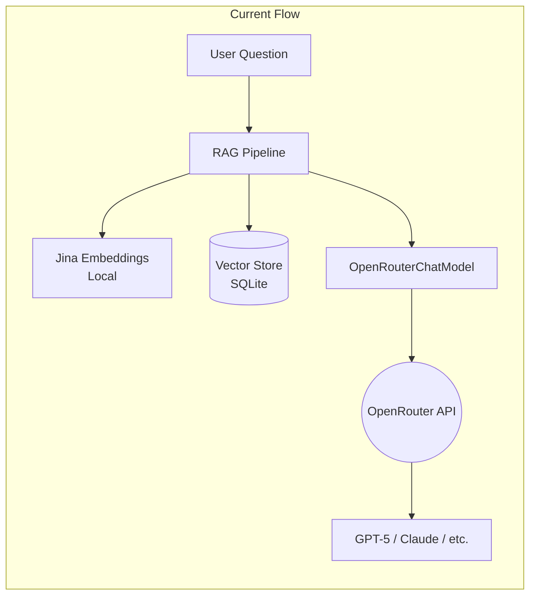
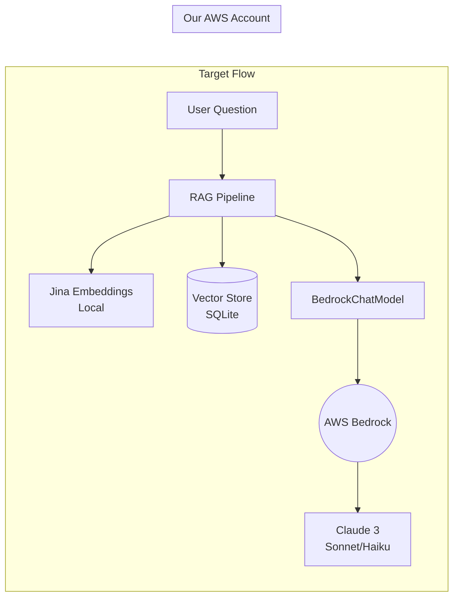
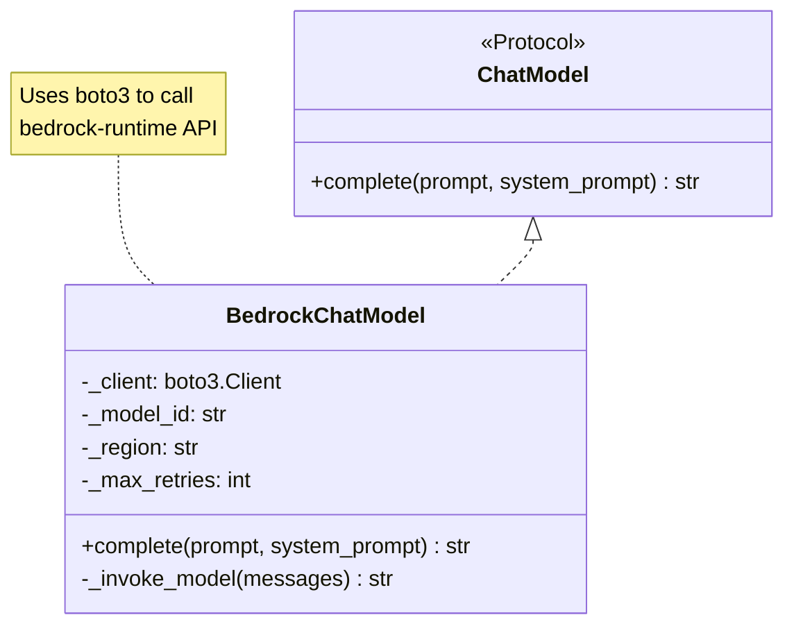
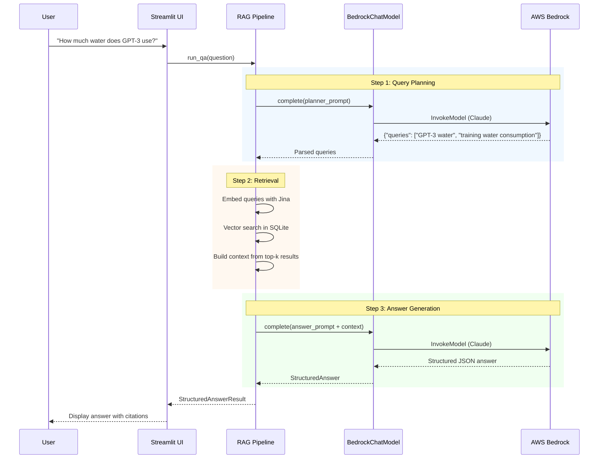

# AWS Bedrock Integration Proposal

> **Author**: Nils  
> **Date**: January 14, 2026  
> **Status**: 📋 Awaiting Review from Chris  
> **Branch**: `bedrock`

---

## Hey Chris 👋

Before I start writing any code, I wanted to put together this document to outline my plan for the Bedrock integration. I've never used Bedrock before and want to make sure I understand the architecture correctly before diving in. Please let me know if anything looks off or if you have suggestions!

---

## 1. What I Understand So Far

Based on our meeting notes and my review of the KohakuRAG codebase, here's my understanding:

### Current Setup (OpenRouter)

The KohakuRAG pipeline currently uses **OpenRouter** to access LLMs (like GPT-5, Claude, etc.). OpenRouter is basically a unified API that routes requests to different model providers.



### What We Want (Bedrock)

We want to replace OpenRouter with **AWS Bedrock** so we:

- Stay within the AWS ecosystem (easier for Chris to manage)
- Pay only when we use it (no idle costs)
- Have better control over access and billing



---

## 2. Where I'll Make Changes

I've identified three files I need to modify in the KohakuRAG codebase:

### 2.1 `src/kohakurag/llm.py`

This is where all the LLM integrations live. Currently has:

- `OpenAIChatModel` - for direct OpenAI API
- `OpenRouterChatModel` - for OpenRouter (what we're currently using)

**I'll add**: `BedrockChatModel` - new class for AWS Bedrock

### 2.2 `scripts/wattbot_answer.py`

This is the main script that runs the RAG pipeline. It has a `create_chat_model()` factory function that creates the LLM client based on config.

**I'll update**: Add `"bedrock"` as a valid `llm_provider` option

### 2.3 `pyproject.toml`

Dependencies file.

**I'll add**: `boto3` (AWS SDK for Python)

---

## 3. The BedrockChatModel Class

Here's what I'm planning to build. The key insight is that Claude 3 on Bedrock uses a "Messages API" format similar to OpenAI, so the code structure should be familiar.



### Sample Code (What I'll Implement)

```python
class BedrockChatModel(ChatModel):
    """Chat backend powered by AWS Bedrock."""
    
    def __init__(
        self,
        model_id: str = "anthropic.claude-3-sonnet-20240229-v1:0",
        region: str = "us-east-2",
        system_prompt: str | None = None,
    ):
        self._client = boto3.client('bedrock-runtime', region_name=region)
        self._model_id = model_id
        self._system_prompt = system_prompt
    
    async def complete(self, prompt: str, *, system_prompt: str | None = None) -> str:
        # Format for Claude 3 Messages API
        body = {
            "anthropic_version": "bedrock-2023-05-31",
            "max_tokens": 4096,
            "messages": [{"role": "user", "content": prompt}],
        }
        if system_prompt or self._system_prompt:
            body["system"] = system_prompt or self._system_prompt
        
        # Call Bedrock
        response = self._client.invoke_model(
            modelId=self._model_id,
            body=json.dumps(body),
        )
        
        # Parse response
        result = json.loads(response['body'].read())
        return result['content'][0]['text']
```

---

## 4. Request Flow (Detailed)

This diagram shows exactly what happens when a user asks a question:



---

## 5. Questions I Have For You

Before I start coding, I'd appreciate your input on these:

### 5.1 Model Selection

| Model | Cost (Input/Output per 1K tokens) | Speed | Quality |
|-------|-----------------------------------|-------|---------|
| Claude 3 Haiku | $0.00025 / $0.00125 | Fastest | Good |
| Claude 3 Sonnet | $0.003 / $0.015 | Medium | Better |
| Claude 3.5 Sonnet | $0.003 / $0.015 | Medium | Best |

**My suggestion**: Use **Haiku for query planning** (fast & cheap, just generating search queries) and **Sonnet for answer generation** (quality matters more for the final answer).

**Question**: Does this make sense, or should we use the same model for both?

### 5.2 Region

Based on the AWS console link, it looks like we're in **US East (Ohio) / us-east-2**. Is that correct? Should I hardcode this or make it configurable?

### 5.3 Model Access

When I log into the AWS console, I need to check if Claude models are already enabled in Bedrock. Do you know if they are, or should I request access first?

### 5.4 Fallback Strategy

If Bedrock fails (rate limits, outage, etc.), should I:

- Just fail and show an error?
- Fall back to OpenRouter?
- Something else?

---

## 6. My Implementation Plan

Here's what I'll do, in order:

### Phase 1: AWS Setup Verification ⏳

- [ ] Log into AWS Console via SSO
- [ ] Navigate to Bedrock → Model Access
- [ ] Verify Claude models are enabled
- [ ] Install AWS CLI locally
- [ ] Configure SSO profile (`aws configure sso`)
- [ ] Test with `aws sts get-caller-identity`

### Phase 2: Local Development Setup

- [ ] Add `boto3` to `pyproject.toml`
- [ ] Create `.env.example` with AWS config
- [ ] Test basic Bedrock call (standalone script)

### Phase 3: Code Implementation

- [ ] Implement `BedrockChatModel` class
- [ ] Add to `create_chat_model()` factory
- [ ] Write unit tests with mocked boto3
- [ ] Integration test with real Bedrock

### Phase 4: Documentation & PR

- [ ] Update README with Bedrock setup instructions
- [ ] Create PR for team review
- [ ] Document any gotchas I encounter

---

## 7. Timeline Estimate

| Phase | Estimated Time | Notes |
|-------|---------------|-------|
| Phase 1 | 1-2 hours | Depends on AWS access issues |
| Phase 2 | 1 hour | Straightforward |
| Phase 3 | 3-4 hours | Main implementation work |
| Phase 4 | 1 hour | Documentation |

**Total**: ~1 day of focused work

---

## 8. What I Need From You

1. ✅ **AWS Access** - Already have it (thank you!)
2. 🔲 **Model Access Confirmation** - Are Claude models enabled in Bedrock?
3. 🔲 **Review This Document** - Any concerns before I start?
4. 🔲 **Answers to Questions** - Section 5 above

---

## Appendix: Helpful Commands

```bash
# AWS SSO Login (I'll need to run this daily)
aws configure sso
aws sso login --profile <profile-name>

# Verify credentials
aws sts get-caller-identity

# Test Bedrock access (once implemented)
python -c "import boto3; print(boto3.client('bedrock').list_foundation_models())"
```

---

**Thanks for reviewing! Let me know if you have any questions or concerns.** 🙏

— Nils
